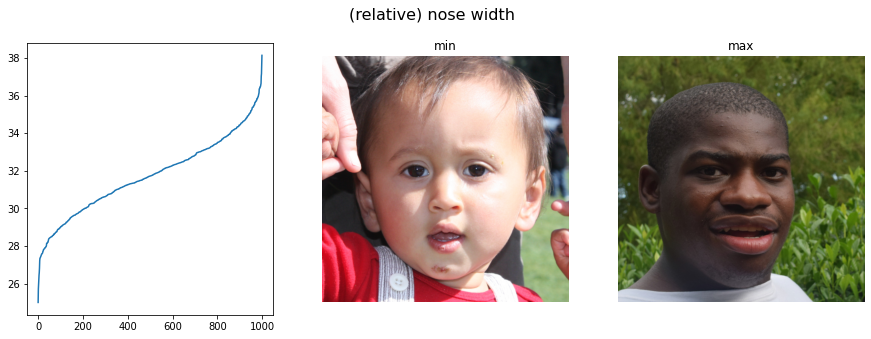
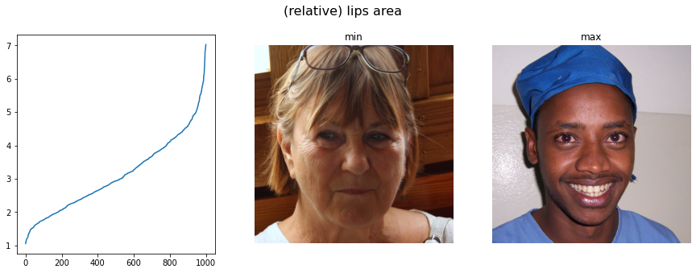

# Transfer-Learning_Competition

Code for the Transfer-Learning competition.

## Re-Labelling

We explore metrics in the re-labelling folder.
We then relabel the FFHQ dataset (in the data subfolder).
We finally perform a metrics analysis.

Here are statistics on the first 1000 images of the FFHQ dataset:

## Transformations

### Continous Transformations

We calculate continuous deformations of the images to make the desired transformations:

- first, for each keypoint, we define the desired translation
- then, we interpolate between the keypoints
- finally, we smooth out the translation map

_(Inverting this map gives the opposite transformation)_

For the nose, we have 4 possible transformations:

---

We use a similar technique to make large and small lips:

_we found that when the mouth is open,
this usually do not work that well._

---

And again to make round or narrow eyes:

### Skin tone transforms

To change the skin tone, we create a mask of the skin (using RGB conditions):

_note that we used RGB conditions,
but HVS conditions might work better..._

using this mask, we get what skin tone is the person;
we then apply the correspondong transform in the HVS colorspace:

_note that we only transform the V and S values,
this gives better results, and can be interpreted as
"the H value is a chracteristic of the person,
while the V&S values correspond to their skin tone"_

### Bag under eyes

To create bags under eyes, we just darken the region under the eyes:

